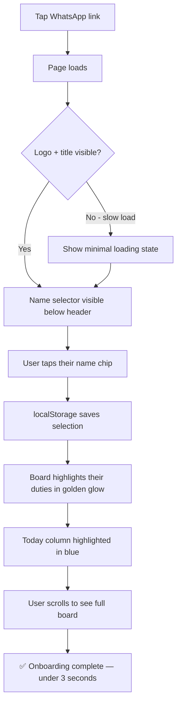
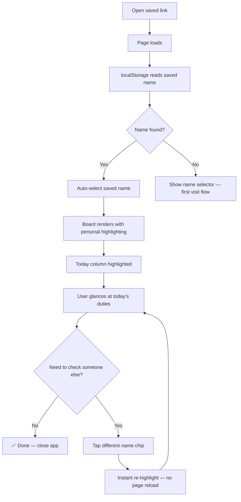
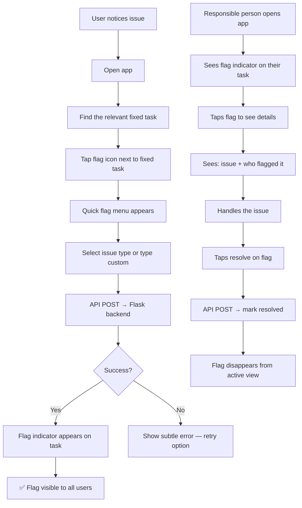

# UX Design Specification - mbat-start

**Author:** Mosh.s
**Date:** 2026-03-04

---

## Executive Summary

### Project Vision

mbat-start is a zero-friction family duty board that replaces a paper chore chart with a mobile-first Hebrew web app. The core UX principle: open → see your name highlighted → know your duties. No login, no navigation, no complexity. The שאגת האריה lion branding and blue-white palette transform mundane chores into meaningful family contribution during a national period.

### Target Users

8 family members across 3 generations (ages 12–120), all smartphone-comfortable. Primary interaction pattern: quick daily glance on phone (< 30 seconds). Key user archetypes:

- **Quick Checker** (Erez, Alon, Adi, Grandma): "What's mine today?" — in and out in seconds
- **Coordinator** (Vered): "Who's helping me tonight?" — scans other people's duties
- **Admin** (Mosh, Ma'ayan): Edits schedule via config file, checks the full board

### Key Design Challenges

1. **Tables on mobile** — 4 rotation tables × 5 day-columns must be fully readable on 375px screens without horizontal scrolling or truncation
2. **Highlighting clarity** — Selected person's duties must visually "pop" across all sections while keeping the full schedule readable for coordination
3. **RTL table layout** — Hebrew right-to-left with Sunday-first columns must feel natural and scannable

### Design Opportunities

1. **The 3-second moment** — Name selection → instant personal glow across the entire board. This single interaction is the product's core value delivery
2. **Emotional branding as UX** — Lion logo, family motto, and blue-white palette make a chore list feel like a family identity piece
3. **Today column anchor** — Highlighting today's column creates an immediate "what's relevant right now" focal point

## Core User Experience

### Defining Experience

The core interaction is a **daily duty glance**: open → see your highlighted duties → close. This is a sub-30-second interaction repeated daily by all family members. Two interactions define the product:

1. **Name selection** (first visit): Pick your name from the family list — this IS the onboarding
2. **Personal highlighting** (every visit): Your duties glow across the entire board — this IS the value

Everything else (branding, tables, today column) supports this glance pattern.

### Platform Strategy

| Aspect | Decision |
|--------|----------|
| **Platform** | Mobile web SPA (single HTML file) |
| **Primary input** | Touch (phone screens) |
| **Secondary** | Desktop browser (admin config editing) |
| **Offline** | Not needed — schedule is current-state reference |
| **Device features** | `prefers-color-scheme` for automatic dark mode |
| **Scrolling model** | Single vertical scroll — entire app visible in one page |

### Effortless Interactions

- **Return visit**: localStorage remembers selected name — no re-selection needed
- **Today awareness**: Current day column auto-highlighted on load
- **Dark mode**: Adapts to device preference with zero user action
- **Full visibility**: No tabs, no toggles, no hidden content — one scroll shows everything
- **Name switching**: Tap a different name to see their view — instant re-highlight

### Critical Success Moments

1. **First open (the 3-second test)**: WhatsApp link → name picker → personal board. If this doesn't feel instant and delightful, adoption fails. This is the make-or-break moment.
2. **Daily return (the 10-second test)**: App loads with your name remembered, today highlighted, duties glowing. If the answer to "what's mine today?" takes longer than 10 seconds, the paper chart wins.
3. **Coordination glance**: A family member (especially Vered) checks someone else's duties. Full board visibility means the answer is found without switching views or modes.

### Experience Principles

1. **Glance, don't read** — Visual scanning over text reading. Emojis, color highlighting, and spatial position convey information faster than words.
2. **One page, zero navigation** — No tabs, routes, or modals. Vertical scroll is the only navigation beyond name selection.
3. **Your name is your login** — Name selection is the personalization layer. Zero accounts, zero friction, zero passwords.
4. **Today first, week for context** — Today's column anchors attention; surrounding days provide planning context.
5. **Warm, not corporate** — Lion logo, family motto, and handpicked emojis make this feel like the family's own app.

## Desired Emotional Response

### Primary Emotional Goals

1. **Belonging** — "This is our family's app." Every element — lion logo, personal names, handpicked emojis — communicates that this was built for this specific family, not downloaded from an app store.
2. **Clarity** — "I know exactly what's mine." Zero ambiguity. Open the app, see your duties glowing. No searching, no asking, no guessing.
3. **Quiet pride** — "I'm doing my part." The שאגת אריה framing connects daily chores to meaningful family contribution during a national period. Taking out the trash becomes an act of duty.

### Emotional Journey Mapping

| Moment | Desired Feeling | Design Lever |
|--------|----------------|--------------|
| First open (WhatsApp link) | Surprise + warmth | Lion logo, polished design, "Dad made this for us?" |
| Name selection | Ownership | Personal name in the selector, emoji identity |
| Seeing duties highlighted | Clarity + accountability | Bold highlighting, instant visual scan |
| Daily return | Routine comfort | Remembered name, familiar layout, today column |
| Seeing a flag (v1.1) | Gentle nudge | Informational tone, not punitive |
| Flagging someone (v1.1) | Peer empowerment | Direct action, no parent involvement needed |

### Micro-Emotions

- **Confidence over confusion** — Layout clarity so high that Grandma finds her Thursday lunch in 10 seconds
- **Belonging over isolation** — Full family board visible creates collective identity
- **Accountability over surveillance** — The app informs duties, never tracks or scores compliance
- **Warmth over sterility** — Emojis, lion branding, and family motto keep the tone human and personal

### Design Implications

| Emotional Goal | UX Design Approach |
|---------------|-------------------|
| Belonging | Family-specific branding, personal emojis per member, lion logo prominent |
| Clarity | Strong visual highlighting, today column anchor, minimal text, glanceable layout |
| Quiet pride | Family motto visible, שאגת אריה identity woven throughout |
| No guilt/shame | Flags are informational labels, no completion tracking, no scores |
| No surveillance | No usage tracking visible to others, no "last seen" indicators |
| No digital nagging | No notifications in v1, flags in v1.1 are passive (visible when you open the app) |

### Emotional Design Principles

1. **Inform, never nag** — The app shows what's needed. It never pushes, reminds, or guilts.
2. **Family identity over utility** — The lion logo and motto aren't decoration — they're the emotional core that transforms a chore list into a family mission board.
3. **Peer accountability, not parental enforcement** — Flagging (v1.1) is designed for kids to hold each other accountable, bypassing the parent-nag dynamic.
4. **Delight on first contact** — The first-open moment must create a "wow, this is ours" reaction that drives adoption.

## UX Pattern Analysis & Inspiration

### Inspiring Products Analysis

**Weather Apps (Apple Weather / Google Weather)** — Near-identical interaction pattern to mbat-start: open → glance at today → close in under 10 seconds, repeated daily.

| Pattern | Weather App | mbat-start Application |
|---------|------------|----------------------|
| Data hierarchy | Current temp is largest, forecast below | Today's duties most prominent, weekly schedule below |
| Today-first | Today is the hero element | Today column highlighted as focal point |
| Color as data | Temperature maps to color gradients | Highlighting color = "this is yours" |
| No onboarding | Auto-detects location | Auto-remembers name via localStorage |
| Single scroll | Everything on one vertical page | Full board in one scroll, no tabs |

**WhatsApp** — The family's existing daily-use app. UX conventions the family already understands intuitively.

| Pattern | WhatsApp | mbat-start Application |
|---------|---------|----------------------|
| Identity | Name + avatar = instant recognition | Name + personal emoji = instant recognition |
| Emphasis | Bold = unread/important | Glow/highlight = your duties |
| Shared context | Same group, personal notification state | Same board, personal highlighting |
| Accessibility | Used by every family member already | Must match the tap/scroll/visual language they know |

### Transferable UX Patterns

1. **Glanceable data hierarchy** (Weather) — Most important information (today, your duties) gets the most visual weight. Secondary info is visible but doesn't compete.
2. **Color as information carrier** (Weather) — Use color to encode meaning (personal highlight, today column) rather than relying on text labels.
3. **Name + visual identifier** (WhatsApp) — Each family member recognizable by name + emoji, creating instant personal connection.
4. **Bold/emphasis for relevance** (WhatsApp) — Visual weight draws the eye to what matters to YOU, without hiding the rest.
5. **Zero learning curve** (Both) — If Grandma uses WhatsApp daily, mbat-start must feel equally intuitive.

### Anti-Patterns to Avoid

| Anti-Pattern | Why It Fails for mbat-start |
|-------------|---------------------------|
| **Account creation / login** | Kills the 3-second onboarding. Family already knows who they are. |
| **Tab navigation** | Hides content. Grandma won't discover Thursday lunch behind a tab. |
| **Gamification (points, streaks)** | Turns family duty into competition. Conflicts with "quiet pride" goal. |
| **Completion checkboxes** | Implies tracking and surveillance. This is a duty board, not a to-do app. |
| **Push notifications** | Becomes digital nagging. Contradicts "inform, never nag" principle. |
| **Complex settings** | No settings needed. Dark mode is automatic, name is remembered. |

### Design Inspiration Strategy

**Adopt directly:**
- Weather app's single-scroll, today-first, glanceable hierarchy
- WhatsApp's name + visual identifier pattern
- Both apps' zero-onboarding approach

**Adapt for mbat-start:**
- Weather's color-as-data → personal highlight color system (your duties glow)
- WhatsApp's bold-for-unread → bold/glow-for-yours across the full board

**Explicitly reject:**
- All chore-app conventions (accounts, gamification, tracking, notifications)
- Any pattern that adds friction, hides content, or implies surveillance

## Design System Foundation

### Design System Choice

**Minimal Custom Design System** — Hand-written CSS with CSS Custom Properties (variables) for theming. No external frameworks, no component libraries, no build tools.

This is driven by the project's core constraint: vanilla HTML/CSS/JS, zero dependencies, single-file deployment. The UI surface is small enough (header, name selector, task list, schedule tables) that a framework would add more weight than value.

### Rationale for Selection

| Factor | Decision Driver |
|--------|----------------|
| **Zero dependencies** | PRD mandates no frameworks, no build pipeline |
| **Page weight < 500KB** | Framework CSS alone would consume a significant portion of the budget |
| **Simple UI surface** | ~4 element types don't warrant a component library |
| **Dark mode** | CSS custom properties handle light/dark theming natively |
| **Single-file deployment** | Inline CSS in one HTML file — impossible with framework builds |
| **Maintenance** | One developer (AI-assisted) — no team to onboard on a framework |

### Implementation Approach

- **CSS Custom Properties** as the design token layer — all colors, spacing, and typography defined as variables on `:root`
- **`prefers-color-scheme` media query** swaps custom property values for dark mode
- **Semantic HTML elements** — `<header>`, `<section>`, `<table>`, `<button>` — no custom components needed
- **System font stack** — `system-ui, -apple-system, sans-serif` — Hebrew support built into all target devices
- **No CSS preprocessor** — plain CSS is sufficient for this scope

### Customization Strategy

**Design Tokens (CSS Custom Properties):**

| Token Category | Purpose |
|---------------|---------|
| `--color-primary` | Blue from שאגת האריה palette |
| `--color-background` | White (light) / dark surface (dark) |
| `--color-text` | Dark text (light) / light text (dark) |
| `--color-highlight` | Personal duty highlighting glow |
| `--color-today` | Today column background accent |
| `--color-surface` | Card/table background |
| `--spacing-*` | Consistent spacing scale |
| `--radius-*` | Border radius for cards and buttons |
| `--font-size-*` | Typography scale (16px base minimum) |

All visual theming flows through these tokens. Changing the palette or switching light/dark mode requires changing only the token values.

## Defining Experience

### The Core Interaction

**"Pick your name → your duties glow."**

One action delivers the full product value. The name selection triggers a board-wide personal highlight that transforms a generic duty chart into YOUR duty chart. This is the interaction users describe to friends: "You pick your name and it shows you all your chores."

### User Mental Model

The family's mental model is the **paper chart on the wall**: walk up, scan for your name, trace across the row to find your duties. mbat-start digitizes this exact behavior — tapping your name replaces the physical scan. The highlight IS the finger tracing the row, done instantly by the app.

This means:
- No new mental model to learn
- The app feels like a better version of what they already do
- Layout should mirror the paper chart's structure (fixed tasks + weekly grid)

### Success Criteria

| Criteria | Target | Why It Matters |
|----------|--------|---------------|
| First-time name selection | < 3 seconds from page load | The 3-second onboarding test |
| Return visit (name remembered) | Duties visible in < 1 second | Faster than walking to the paper chart |
| "What's mine today?" answer | < 5 seconds, zero taps (return user) | The daily value proposition |
| Name switching | < 100ms re-highlight | Coordination glance for Vered checking helpers |

### Pattern Analysis

All established patterns — zero novel interactions required:

| Pattern | Source Mental Model | mbat-start Usage |
|---------|-------------------|-----------------|
| Name selector | WhatsApp contact picker | Tap name from family list |
| Personal highlighting | Selection state (any app) | Duties glow when name is selected |
| Table grid | Spreadsheet / calendar | Weekly schedule with day columns |
| Today indicator | Weather / calendar apps | Current day column highlighted |

No user education needed. Every interaction maps to patterns the family uses daily in WhatsApp and weather apps.

### Experience Mechanics

**First Visit Flow:**

1. **Initiation** — Tap WhatsApp link → page loads → lion logo + name selector visible
2. **Interaction** — Tap your name from the family list
3. **Feedback** — Instant board-wide highlight: your duties glow across all sections
4. **Completion** — Scroll to see full board. Today column already marked. Duty check complete.
5. **Persistence** — localStorage saves selected name for future visits

**Return Visit Flow:**

1. **Initiation** — Tap saved link → page loads with name pre-remembered
2. **Interaction** — None needed (or tap different name to switch view)
3. **Feedback** — Board loads pre-highlighted with your duties + today column
4. **Completion** — Glance at today → see your duties → close. Under 10 seconds.

## Visual Design Foundation

### Color System

**Palette derived from the שאגת האריה lion logo** — a strict blue-and-white identity with a warm golden accent for personal highlighting.

**Light Mode:**

| Token | Value | Usage |
|-------|-------|-------|
| `--color-primary` | `#1A4B8C` | Logo blue — headers, name selector active state, brand elements |
| `--color-primary-light` | `#E3F0FF` | Light blue wash — today column background |
| `--color-background` | `#FFFFFF` | Page background |
| `--color-surface` | `#F0F4F8` | Table backgrounds, card surfaces |
| `--color-text` | `#1A1A2E` | Primary text |
| `--color-text-secondary` | `#5A6A7A` | De-emphasized content |
| `--color-highlight` | `#FFF3CD` | Personal duty highlighting — warm golden glow |
| `--color-highlight-border` | `#E6C85A` | Highlight cell border accent |
| `--color-border` | `#D0D8E0` | Table borders, dividers |

**Dark Mode:**

| Token | Value | Usage |
|-------|-------|-------|
| `--color-primary` | `#4A90D9` | Lighter blue for dark backgrounds |
| `--color-primary-light` | `#1A2A44` | Blue-tinted dark — today column |
| `--color-background` | `#1A1A2E` | Deep navy page background |
| `--color-surface` | `#252540` | Table/card surfaces |
| `--color-text` | `#E8ECF0` | Light text on dark |
| `--color-text-secondary` | `#8A9AAA` | De-emphasized content |
| `--color-highlight` | `#3D3520` | Warm dark glow for highlighted duties |
| `--color-highlight-border` | `#8A7A30` | Muted gold border on dark |
| `--color-border` | `#3A3A5A` | Dark mode borders |

**Design rationale:** The warm golden highlight is intentionally off-palette — it creates immediate visual contrast against the cool blue-white scheme. Your duties "glow warm" while everything else stays cool. This ensures the personal highlighting is unmistakable at a glance.

### Typography System

**Font Stack:** `system-ui, -apple-system, "Segoe UI", sans-serif`

No web fonts — Hebrew is natively supported on all target devices (iOS, Android). System fonts ensure zero load time and natural platform feel.

**Type Scale:**

| Element | Size | Weight | Usage |
|---------|------|--------|-------|
| App title / logo area | 20px | Bold | שאגת הארי header |
| Section headers | 18px | Bold | "משימות קבועות", "לוח שבועי" |
| Table headers | 14px | Bold | Day names, rotation labels |
| Table cells | 14–15px | Normal (400) / Bold (highlighted) | Schedule data |
| Name selector buttons | 16px | Medium (500) | Family member names |
| Family motto | 14px | Normal, italic | Footer motto text |
| Emoji identifiers | 16–18px | — | Task and member emojis |

**Base size:** 16px minimum for body text (accessibility). Table cells at 14px are acceptable for short Hebrew names in a compact grid.

### Spacing & Layout Foundation

**Base unit:** 8px — all spacing uses multiples: 8, 16, 24, 32, 40

| Element | Spacing | Rationale |
|---------|---------|-----------|
| Page side padding | 16px (2 units) | Mobile breathing room without wasting width |
| Section gap | 24px (3 units) | Clear visual separation between fixed tasks and weekly schedule |
| Table cell padding | 8px vertical, 6px horizontal | Compact enough for 5-column mobile fit |
| Name selector buttons | 8px gap between buttons | Touch-friendly spacing |
| Name selector button padding | 12px vertical, 16px horizontal | 48px+ tap target height |
| Header to content | 16px | Tight but clear |
| Motto bottom padding | 24px | Comfortable footer space |

**Layout approach:**
- Single column, full-width on mobile (375px+)
- Tables stretch to full width — no horizontal scroll
- Content centered with max-width on desktop (600px) to prevent over-stretching
- RTL: `dir="rtl"` on `<html>`, natural flow handles alignment

### Accessibility Considerations

| Requirement | Implementation |
|------------|---------------|
| **Color contrast (WCAG AA)** | Text-on-background ratios ≥ 4.5:1 in both light and dark modes |
| **Highlight contrast** | Golden highlight + bold text ensures visibility without relying on color alone |
| **Touch targets** | All interactive elements ≥ 48px height (name selector buttons) |
| **Font sizing** | 16px base prevents iOS auto-zoom on input focus |
| **Dark mode** | Automatic via `prefers-color-scheme` — no manual toggle to discover |
| **Semantic HTML** | Proper `<table>`, `<th>`, `<button>` for screen reader compatibility |
| **No color-only meaning** | Highlighted cells use bold text + background color (two signals) |

## Design Direction Decision

### Design Directions Explored

4 visual directions were generated and evaluated via interactive HTML mockups (`ux-design-directions.html`):

| Direction | Layout | Feel | Key Trait |
|-----------|--------|------|-----------|
| A: Table Classic | Traditional tables | Familiar, paper-chart | Scannable, no learning curve |
| B: Card Modern | Cards per section | Modern, polished | Professional showcase |
| C: Compact | Dense grid + table | Efficient, dashboard | Everything above the fold |
| D: Bold Graphic | Visual cards + pills | Fun, engaging, app-like | Engagement, delight, kids |

### Chosen Direction

**Direction B: Card Modern** — with a unified weekly schedule table (borrowed from A/C) to reduce scrolling.

Key elements:
- **Gradient header** with שאגת האריה lion logo image (`IMG_6949 copy.JPG`) and family motto — creates the "first open delight" moment
- **Chip-style name selector** — modern, touch-friendly, pill-shaped buttons with emoji + name
- **Card containers** for each major section — natural visual separation, shadows, rounded corners
- **Fixed tasks as card list** — each task a row within a card, highlighted rows glow golden
- **Unified weekly table** (from Direction A/C) — all 4 rotations in a single table card instead of 4 separate cards, reducing vertical scroll
- **Today column** highlighted with light blue wash across the unified table
- **Personal highlighting** with warm golden background + bold text on highlighted cells

### Design Rationale

1. **AI showcase quality** — Card-based layouts read as "professionally designed app" to non-technical observers. This directly serves the business success metric.
2. **Mobile-first excellence** — Cards with full-width content work naturally on 375px screens with no horizontal scroll.
3. **Section clarity** — Each card creates a distinct visual zone (fixed tasks, weekly schedule), supporting the "glance, don't read" principle.
4. **Unified table for density** — Combining the 4 weekly rotations into one table (like Direction A/C) keeps the weekly schedule compact and scannable while maintaining the card wrapper for visual polish.
5. **First-open delight** — The gradient header with the real lion logo is the strongest "wow, this is ours" moment across all directions.

### Implementation Approach

**Page structure (top to bottom):**

1. **Header card** — Gradient blue background, centered שאגת האריה lion logo image, "שאגת הארי" title, family motto
2. **Name selector** — Row of chip/pill buttons, horizontally wrapping, selected state = filled blue
3. **Fixed tasks card** — White card with shadow, section title, list of 7 task rows (emoji + task + owner)
4. **Weekly schedule card** — White card with shadow, section title, unified table with 4 rotation rows × 5 day columns + row labels
5. **Footer** — Minimal branding

**Highlighting behavior:**
- Selected name's chip = filled blue with white text
- Fixed task rows matching selected person = golden background + bold + gold border
- Weekly table cells matching selected person = golden background + bold
- Today column = light blue wash background
- Overlap (your duty + today) = golden takes priority (your duty is more important than "what day is it")

## User Journey Flows

### Flow 1: First Visit (Onboarding)

**Trigger:** Family member taps WhatsApp link for the first time.
**Goal:** Pick name → see personal duties. Under 3 seconds to value.



**Key design decisions:**
- No splash screen, no tutorial, no welcome modal — straight to content
- Name selector is immediately visible without scrolling (above the fold)
- Highlight animation is instant (CSS class toggle, no delay)
- Logo loads first (emotional anchor), then content renders

**Error states:**
- No name selected yet → all data visible, nothing highlighted, name selector has subtle "בחר שם" prompt
- localStorage blocked → app still works, just won't remember next time

---

### Flow 2: Return Visit (Daily Check)

**Trigger:** Family member opens app from saved link / home screen.
**Goal:** See today's duties instantly. Under 10 seconds, zero taps.



**Key design decisions:**
- Zero taps for return users — board loads pre-highlighted
- Name switching is instant (JavaScript class toggle, no server call)
- Today column is always auto-detected from device date
- Scroll position resets to top on each visit (today's info first)

**Edge cases:**
- Weekend (Friday/Saturday) → no schedule columns highlighted for today, show full week
- Name selector still visible for switching, but pre-selected name is filled blue

---

### Flow 3: Issue Flagging (v1.1)

**Trigger:** Family member sees an issue (e.g., trash is full) and wants to flag the responsible person.
**Goal:** Flag an issue in under 10 seconds. Peer-to-peer, not parent-driven.



**Key design decisions:**
- Flag icon appears next to each fixed task row only (small, unobtrusive when no flags exist) — weekly rotation duties are not flaggable
- Quick flag menu with common options ("הזבל מלא", "צריך ניקוי", custom text)
- Flags are informational, not punitive — shown as a subtle badge, not a red alert
- Anyone can flag anyone — peer-to-peer, no admin approval
- Only the responsible person (or admin) can resolve a flag

**Error handling:**
- Network failure → flag queued locally, synced when connection returns
- Backend down → graceful degradation, app still works for viewing schedule (v1 features)

---

### Journey Patterns

**Consistent patterns across all flows:**

| Pattern | Implementation | Used In |
|---------|---------------|---------|
| **Instant feedback** | CSS class toggle, no server round-trip (v1) | Name selection, highlighting, today column |
| **Progressive enhancement** | v1 features work without backend, v1.1 adds API calls | All flows |
| **Zero-tap return** | localStorage auto-restores state | Return visit |
| **Graceful degradation** | App functions read-only if API fails (v1.1) | Flagging |
| **Peer-to-peer action** | Any user can flag any fixed task | Flagging |

### Flow Optimization Principles

1. **Eliminate every unnecessary tap** — Return users should get their answer with zero interaction. First-time users need exactly one tap (name selection).
2. **No loading spinners** — The app is small enough (< 500KB) to load before a spinner would appear. If anything, show content progressively (header first, then tables).
3. **Instant visual response** — Every interaction (name tap, flag tap) produces immediate visual change. No waiting for server confirmation for read-only operations.
4. **Fail silently for reads, notify for writes** — Schedule viewing never fails (static data). Flag submission shows feedback on success/failure.
5. **State lives in two places** — localStorage for personal preference (name), server for shared state (flags in v1.1). Keep them independent.

## Component Strategy

### Design System Components

**No external component library.** All components are custom-built using semantic HTML + CSS custom properties. The component surface is intentionally small — 8 components for v1, 2 additional for v1.1.

### Custom Components

#### 1. App Header

**Purpose:** Emotional anchor — first thing users see. Establishes שאגת הארי identity.
**Content:** Lion logo image, "שאגת הארי" title, family motto
**States:** Single state (no interaction)
**HTML:** `<header>` with gradient background
**Accessibility:** Logo has `alt` text, heading hierarchy starts at `<h1>`

#### 2. Name Chip

**Purpose:** Family member selector — the app's only onboarding interaction.
**Content:** Emoji identifier + Hebrew name (e.g., "🦁 ארז")
**States:**
- **Default** — light background, border, normal weight
- **Selected** — filled blue background, white text, subtle shadow
- **Hover/focus** — slight background darkening (desktop)
**HTML:** `<button>` elements in a flex-wrap container
**Accessibility:** `aria-pressed` for selected state, 48px+ tap target, keyboard-navigable

#### 3. Section Card

**Purpose:** Visual container grouping related content (fixed tasks, weekly schedule).
**Content:** Section title + child content
**States:** Single state (no interaction)
**HTML:** `<section>` with CSS class for card styling (white bg, border-radius, box-shadow)
**Variants:** Same style for both fixed tasks card and weekly schedule card

#### 4. Fixed Task Row

**Purpose:** Displays one fixed daily responsibility with its assigned owner.
**Content:** Task emoji + task name + owner emoji + owner name
**States:**
- **Default** — normal weight, standard background
- **Highlighted** — golden background, bold text, gold border (selected person's task)
**HTML:** Flex row inside the section card
**Accessibility:** Highlighted state uses bold text + background (not color alone)

#### 5. Weekly Schedule Table

**Purpose:** Displays all 4 rotation schedules in a unified grid.
**Content:** 4 rotation rows × 5 day columns + row labels + day headers
**States:** Table itself has no interaction state
**HTML:** `<table>` with `<thead>` (day names) and `<tbody>` (rotation rows)
**Accessibility:** `<th scope="col">` for days, `<th scope="row">` for rotation labels

#### 6. Table Cell

**Purpose:** Individual schedule cell showing who's assigned for a specific day + rotation.
**Content:** Family member name (short Hebrew name, sometimes with emoji)
**States:**
- **Default** — normal background, normal weight
- **Today** — light blue wash background (`--color-primary-light`)
- **Highlighted** — golden background, bold text (`--color-highlight`)
- **Today + Highlighted** — golden takes priority (bold + golden bg)
**HTML:** `<td>` with conditional CSS classes
**Accessibility:** Bold text + background color (two signals, not color-only)

#### 7. Day Header

**Purpose:** Column header showing day of week in the weekly table.
**Content:** Day abbreviation (א׳, ב׳, ג׳, ד׳, ה׳)
**States:**
- **Default** — blue background, white text
- **Today** — darker blue or underlined to indicate current day
**HTML:** `<th>` inside `<thead>`

#### 8. Footer

**Purpose:** Closes the page with family motto or minimal branding.
**Content:** "בואו נשאג ביחד על המשימות! כל אחד תורם 🦁"
**States:** Single state
**HTML:** `<footer>` with italic, secondary color text

#### 9. Flag Button (v1.1)

**Purpose:** Allows any user to flag an issue on a fixed task (not weekly rotation duties).
**Content:** Small flag icon (🚩 or SVG)
**States:**
- **Default** — subtle, grey, unobtrusive
- **Hover** — slightly enlarged or colored
- **Active flag exists** — red/orange badge with count
**HTML:** `<button>` next to each fixed task row
**Accessibility:** `aria-label="דגל בעיה"`, 44px+ tap target

#### 10. Flag Badge (v1.1)

**Purpose:** Shows active flag details on a task.
**Content:** Issue description + who flagged it + resolve button
**States:**
- **Active** — visible badge/tooltip with flag info
- **Resolved** — hidden (flag removed from view)
**HTML:** Expandable element triggered by flag button tap
**Accessibility:** `aria-live="polite"` for new flags, resolve button keyboard-accessible

### Component Implementation Strategy

**All components built with:**
- Semantic HTML elements (`<button>`, `<table>`, `<header>`, `<section>`, `<footer>`)
- CSS custom properties for all colors, spacing, and theming
- CSS classes for state management (`.selected`, `.highlighted`, `.today`)
- JavaScript toggles CSS classes — no DOM manipulation beyond class changes
- Dark mode handled entirely through CSS custom property swaps in `@media (prefers-color-scheme: dark)`

**No component framework needed.** The total component count (8 for v1, 10 for v1.1) is small enough that plain CSS manages everything. Each component is a CSS class applied to a semantic HTML element.

### Implementation Roadmap

**Phase 1 — MVP (v1):** All 8 core components

| Priority | Component | Needed For |
|----------|-----------|-----------|
| 1 | App Header | First-open delight, emotional anchor |
| 2 | Name Chip | Core interaction — name selection |
| 3 | Fixed Task Row | Fixed duties display + highlighting |
| 4 | Weekly Schedule Table + Table Cell + Day Header | Weekly schedule + today + highlighting |
| 5 | Section Card | Visual structure wrapping content |
| 6 | Footer | Page completion, motto |

**Phase 2 — v1.1:** 2 additional components

| Priority | Component | Needed For |
|----------|-----------|-----------|
| 7 | Flag Button | Issue flagging trigger |
| 8 | Flag Badge | Flag details + resolution |

## UX Consistency Patterns

### Selection & Highlighting Patterns

**Name Selection:**
- Single-selection model — only one name active at a time
- Tapping a new name deselects the previous one (radio-button behavior)
- Selected name chip: filled blue background (`--color-primary`), white text
- Deselected name chips: light background, border, normal weight
- Selection triggers instant board-wide re-highlight via CSS class toggling

**Personal Highlighting:**
- All elements matching the selected person receive the `.highlighted` CSS class
- Highlighted state: golden background (`--color-highlight`) + bold text + gold left border (`--color-highlight-border`)
- Highlighting applies to: fixed task rows + weekly table cells
- No animation/transition on highlight change — instant swap for snappy feel
- When no name is selected: no highlighting, full board visible in default state

**Today Column Highlighting:**
- Auto-detected from device date (`new Date().getDay()`)
- Today column: light blue background (`--color-primary-light`)
- Applies to day header + all cells in that column
- Friday/Saturday (weekend): no today column highlighted — show full week with no day emphasis

### State Indicator Patterns

**Overlap State Truth Table:**

When a cell is both "today" and "highlighted" (the selected person has a duty today), which style wins?

| Name Selected? | Is Today Column? | Cell Matches Person? | Visual Result |
|---------------|-----------------|---------------------|---------------|
| No | No | — | Default (white/surface) |
| No | Yes | — | Today (light blue) |
| Yes | No | No | Default (white/surface) |
| Yes | No | Yes | Highlighted (golden + bold) |
| Yes | Yes | No | Today (light blue) |
| Yes | Yes | Yes | **Highlighted wins** (golden + bold) |

**Key rule:** Personal highlighting always takes priority over today column. Your duties are more important than what day it is.

**CSS implementation:** `.highlighted` class overrides `.today` class. Both classes can coexist on the same element, but `.highlighted` properties win via specificity or declaration order.

### Feedback Patterns

**v1 Feedback (Static MVP):**

| Interaction | Feedback | Timing |
|------------|----------|--------|
| Name chip tap | Chip fills blue, board highlights | Instant (< 16ms — single frame) |
| Name switch | Previous deselects, new selects, board re-highlights | Instant |
| Page load (return user) | Pre-highlighted board renders | On DOM ready |
| Weekend visit | No today column highlighted | On load — no special messaging |

No loading spinners, no progress indicators, no toasts. The app is small enough that everything is instant.

**v1.1 Feedback (Flagging):**

| Interaction | Feedback | Timing |
|------------|----------|--------|
| Flag button tap | Quick flag menu appears | Instant (CSS/JS) |
| Flag submission | Flag icon turns active (red/orange badge) | After API confirmation (< 2s) |
| Flag submission failure | Subtle inline error + retry option | After timeout (3s) |
| Flag resolution | Badge disappears, task row returns to normal | After API confirmation |
| Backend offline | v1 features work normally, flag buttons disabled or show offline state | On failed health check |

### Empty & Edge States

| Scenario | Behavior | Visual |
|----------|----------|--------|
| No name selected (first visit) | Full board visible, no highlighting | Name selector shows subtle "בחר שם" prompt |
| Weekend (Fri/Sat) | Weekly schedule visible, no today column highlighted | Full week shown equally |
| localStorage unavailable | App works normally, just no name persistence | Name selector shown every visit |
| v1.1: No active flags | Flag buttons visible but subtle (grey) | Clean board, no badges |
| v1.1: Backend unreachable | Schedule displays normally (static data), flagging disabled | Flag buttons greyed out or hidden |

### Patterns NOT Needed

Explicitly excluded to maintain simplicity:

| Pattern | Why Excluded |
|---------|-------------|
| **Loading skeleton/shimmer** | Page loads in < 500ms — skeleton would flash and disappear |
| **Pull-to-refresh** | Static data, no server to refresh from (v1) |
| **Infinite scroll / pagination** | All content fits on one scrollable page |
| **Toast notifications** | No async operations in v1 that need notification |
| **Modal dialogs** | No confirmation flows — name selection is a simple tap |
| **Undo/redo** | Name switching is instant and free — no destructive actions |
| **Onboarding tutorial / tooltips** | Zero learning curve — name picker is self-evident |
| **Error pages (404, 500)** | Single-page static app — no routing, no server errors |
| **Empty state illustration** | There's always data — the schedule is hardcoded |

## Responsive Design & Accessibility

### Responsive Strategy

**Mobile-first, single-breakpoint approach.** mbat-start is a phone app that happens to work on desktop. The primary viewport is 375px (iPhone SE/mini) and the design scales up gracefully.

**Mobile (375px–599px) — Primary:**
- Full-width cards, single column layout
- Name chips wrap naturally via flexbox
- Weekly table uses compact cell padding (6–8px)
- Header gradient stretches full width
- All content accessible via vertical scroll only

**Desktop (600px+) — Graceful scaling:**
- Content constrained to `max-width: 600px`, centered
- Cards gain slightly more padding
- Table cells have breathing room but layout stays identical
- No multi-column layout — the content doesn't benefit from it
- Lion logo may render slightly larger

**No tablet-specific strategy needed.** The 375px–600px range covers tablets naturally — a phone layout on an iPad mini is perfectly usable. There's no content density benefit to a tablet-optimized layout for this simple board.

**Explicitly skipped:**
- No hamburger menu (no navigation to hide)
- No sidebar (no secondary content)
- No multi-column grid (one column serves all screen sizes)
- No landscape-specific layout (portrait is the natural phone orientation)

### Breakpoint Strategy

**Single breakpoint, mobile-first:**

| Breakpoint | Target | Layout Change |
|-----------|--------|---------------|
| **Base (0px+)** | Mobile phones | Full-width, compact padding, small table cells |
| **600px+** | Large phones + desktop | `max-width: 600px` content centering, relaxed padding |

```css
/* Base: mobile-first */
.app { width: 100%; padding: 0 16px; }

/* Desktop: center and constrain */
@media (min-width: 600px) {
  .app { max-width: 600px; margin: 0 auto; padding: 0 24px; }
}
```

**Why only one breakpoint?**
- The app is a single-column vertical scroll — no layout transformation needed
- Tables don't benefit from being wider than 600px (Hebrew names are short)
- Adding breakpoints without layout changes adds complexity with zero UX improvement
- Mobile-first CSS means the base styles ARE the mobile design — no overrides needed

### Accessibility Strategy

**Target: WCAG 2.1 Level AA** — the industry standard for good accessibility. Full AAA is unnecessary for a family app, but AA ensures Grandma and all family members can use it comfortably.

**Color Contrast:**

| Element | Foreground | Background | Ratio | Passes AA? |
|---------|-----------|-----------|-------|-----------|
| Body text (light) | `#1A1A2E` | `#FFFFFF` | 16.8:1 | Yes |
| Body text (dark) | `#E8ECF0` | `#1A1A2E` | 12.4:1 | Yes |
| Highlighted text (light) | `#1A1A2E` | `#FFF3CD` | 14.2:1 | Yes |
| Highlighted text (dark) | `#E8ECF0` | `#3D3520` | 8.1:1 | Yes |
| Header text (gradient) | `#FFFFFF` | `#1A4B8C` | 8.2:1 | Yes |
| Name chip selected | `#FFFFFF` | `#1A4B8C` | 8.2:1 | Yes |

All combinations exceed the 4.5:1 AA requirement for normal text.

**Keyboard Navigation:**
- Name chips: navigable with Tab key, selectable with Enter/Space
- Focus indicators: visible outline on all interactive elements (never `outline: none`)
- Logical tab order: header → name selector → (content is non-interactive)
- Skip link not needed — only interactive area is the name selector at the top

**Screen Reader Support:**
- `<html lang="he" dir="rtl">` — declares language and direction
- `<h1>` for app title, `<h2>` for section titles — proper heading hierarchy
- `<table>` with `<th scope="col">` and `<th scope="row">` — tables are properly labeled
- `aria-pressed="true/false"` on name chips — communicates selected state
- `aria-label` on emoji-only elements where meaning isn't obvious
- `role="status"` or `aria-live="polite"` for dynamic highlighting changes (v1.1 flag updates)

**Touch Targets:**
- Name chips: 48px+ height with 12px vertical + 16px horizontal padding
- Flag buttons (v1.1): 44px+ tap target
- No small links or icons that require precision tapping
- 8px minimum gap between adjacent tap targets

### Testing Strategy

**Responsive Testing:**

| Device | Priority | How to Test |
|--------|----------|-------------|
| iPhone SE (375px) | Critical | Chrome DevTools / Safari |
| iPhone 14/15 (390px) | High | Real device or simulator |
| Android mid-range (360–412px) | High | Chrome DevTools |
| iPad mini (768px) | Low | Should "just work" via max-width centering |
| Desktop Chrome (1440px) | Low | Verify centering + readability |

**Accessibility Testing:**

| Test | Tool | When |
|------|------|------|
| Color contrast | Chrome DevTools Accessibility panel | During CSS implementation |
| Keyboard navigation | Manual tab-through | After name selector implementation |
| Screen reader | VoiceOver (iOS/Mac) | After HTML structure complete |
| Heading hierarchy | WAVE browser extension | After HTML structure complete |
| Touch target size | Chrome DevTools mobile ruler | After name selector styling |

**Realistic user testing:** Share the app in the family WhatsApp group and observe. If Grandma can find her Thursday lunch, accessibility is sufficient. If the 12-year-olds use it daily without asking for help, the UX works.

### Implementation Guidelines

**Responsive Development:**

```css
/* Mobile-first: base styles ARE mobile */
html {
  font-size: 16px;           /* Prevents iOS auto-zoom */
  -webkit-text-size-adjust: 100%; /* Prevents text inflation */
}

/* Use rem for spacing, not px (except borders) */
.section-card { padding: 1rem; margin-bottom: 1.5rem; }

/* Tables: percentage widths + min-width for readability */
table { width: 100%; border-collapse: collapse; }
td, th { padding: 0.5rem 0.375rem; } /* Compact on mobile */

/* Flexbox wrap for name chips */
.name-selector { display: flex; flex-wrap: wrap; gap: 0.5rem; }
```

**Accessibility Development:**

```html
<!-- Semantic structure -->
<html lang="he" dir="rtl">
<header>
  <h1>שאגת הארי</h1>
</header>
<main>
  <section aria-labelledby="fixed-tasks-title">
    <h2 id="fixed-tasks-title">משימות קבועות</h2>
    <!-- task rows -->
  </section>
  <section aria-labelledby="weekly-title">
    <h2 id="weekly-title">לוח שבועי</h2>
    <table>
      <thead><tr><th scope="col">א׳</th>...</tr></thead>
      <tbody><tr><th scope="row">ארוחת צהריים</th>...</tr></tbody>
    </table>
  </section>
</main>
<footer>בואו נשאג ביחד על המשימות! כל אחד תורם 🦁</footer>
```

```html
<!-- Name chip accessibility -->
<button class="name-chip" aria-pressed="false">
  🦁 ארז
</button>
```

**Key rules:**
- Use `rem` for all spacing and font sizes (except 1px borders)
- Never use `outline: none` without providing alternative focus indicator
- Always pair color meaning with a second signal (bold, border, icon)
- Test with `prefers-color-scheme: dark` in DevTools during development
- Hebrew names are short — table cells rarely need truncation, but add `overflow-wrap: break-word` as safety
